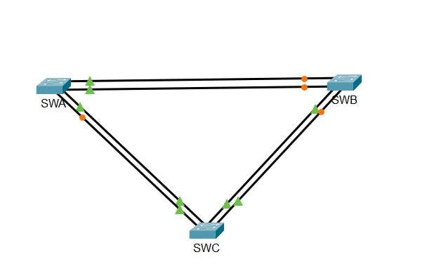

# 🛠️ TP : Configuration d'EtherChannel avec PAgP et LACP

## 📚 Présentation

Dans ce TP, nous avons configuré des liaisons **EtherChannel** entre trois commutateurs (**SWA**, **SWB**, **SWC**) pour **augmenter la bande passante**, **assurer la redondance**, et **optimiser la communication réseau**.

Nous avons utilisé deux protocoles différents pour la négociation automatique :
- **PAgP (Port Aggregation Protocol)** entre SWA et SWB (protocole propriétaire Cisco)
- **LACP (Link Aggregation Control Protocol)** entre SWA-SWC et SWB-SWC (protocole standard IEEE 802.3ad)

---

## 🎯 Objectifs du TP

- Configurer des liaisons trunk entre les switches.
- Créer des agrégations de liens (EtherChannel) pour augmenter la fiabilité et la vitesse.
- Utiliser les protocoles PAgP et LACP pour gérer automatiquement les canaux.

---

## 🧩 Topologie du réseau

- 
---

## 🧰 Configuration des commutateurs

### ➔ Entre **SWA** et **SWB** (PAgP - Port-Channel 1)

**Sur SWA** :
```bash
conf t
interface range gig0/1 - 2
switchport mode trunk
channel-group 1 mode desirable
exit
```

**Sur SWB** :
```bash
conf t
interface range gig0/1 - 2
switchport mode trunk
channel-group 1 mode auto
exit
```

---

### ➔ Entre **SWA** et **SWC** (LACP - Port-Channel 2)

**Sur SWA** :
```bash
conf t
interface range fastEthernet0/21 - 22
switchport mode trunk
channel-group 2 mode active
exit
```

**Sur SWC** :
```bash
conf t
interface range fastEthernet0/21 - 22
switchport mode trunk
channel-group 2 mode active
exit
```

---

### ➔ Entre **SWB** et **SWC** (LACP - Port-Channel 3)

**Sur SWB** :
```bash
conf t
interface range fastEthernet0/23 - 24
switchport mode trunk
channel-group 3 mode passive
exit
```

**Sur SWC** :
```bash
conf t
interface range fastEthernet0/23 - 24
switchport mode trunk
channel-group 3 mode active
exit
```

---

## 🛡️ Vérifications à effectuer

Utiliser les commandes suivantes pour vérifier l'état des EtherChannel :

- `show etherchannel summary` : Voir le résumé des canaux.
- `show interfaces trunk` : Vérifier que les interfaces sont en trunk.
- `show running-config` : Vérifier la configuration appliquée.
- `show etherchannel detail` : Détails approfondis des ports.

---

## ⚡ Résultat attendu

- Tous les Port-Channels doivent être **UP** et fonctionnels.
- La répartition de la charge doit être équilibrée entre les liens.
- La topologie doit être **plus rapide** et **plus résiliente** aux coupures de liens.

---

## ✍️ Auteur

HASSAN IBRAHIM
ibhassan279@gmail.com 


